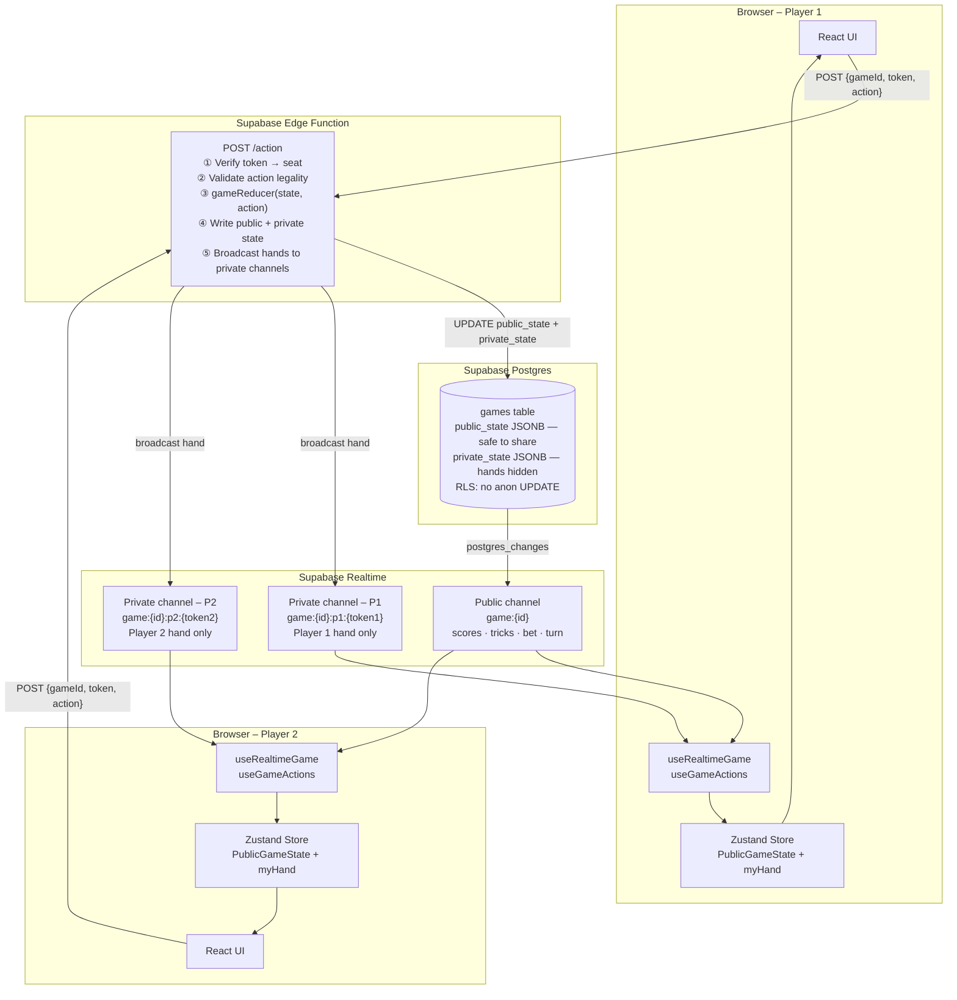

# TrucoMineiro

A real-time multiplayer Truco Mineiro card game built for two players. No accounts, no sign-up — just share a link and play.

**Live:** [www.estebanmarin.me/truco](https://www.estebanmarin.me/truco)

---

## Architecture



### Security model

- **Opponent's cards never reach your browser.** The Edge Function delivers each player's hand only on their private Realtime channel, keyed by a UUID token stored in `localStorage`.
- **All moves are server-validated.** The browser cannot write to the database directly (RLS blocks it). Every action goes through the Edge Function, which verifies the player's token and runs the game reducer before writing.
- **No accounts.** Players are identified by a UUID generated on first visit and persisted in `localStorage`.

---

## Stack

| Layer | Technology |
|---|---|
| Frontend | React 19 + Vite + TypeScript |
| Animations | Framer Motion |
| State | Zustand |
| Realtime | Supabase Realtime (postgres_changes + broadcast) |
| Backend | Supabase Edge Functions (Deno) |
| Database | Supabase Postgres |
| Hosting | GitHub Pages (`/truco` path, hash routing) |

---

## Game rules (Truco Mineiro)

- 40-card deck (French deck, 8s/9s/10s removed)
- 1v1; each player gets 3 cards per hand
- Fixed manilhas (strongest to weakest): **4♣ > 7♥ > A♠ > 7♦**
- Card rank (non-manilha): **3 > 2 > A > K > J > Q > 7 > 6 > 5 > 4**
- Hand starts at 2 points; betting escalates: Truco (4) → Seis (6) → Dez (10) → Doze (12)
- First to **12 points** wins the match

---

## Local development

```bash
# 1. Install dependencies
npm install

# 2. Set up environment
cp .env.example .env.local
# Fill in VITE_SUPABASE_URL and VITE_SUPABASE_ANON_KEY

# 3. Run the DB migration
supabase db push

# 4. Start Edge Functions locally
supabase functions serve

# 5. Start the frontend (in a separate terminal)
npm run dev
# → http://localhost:5173/truco/
```

## Tests

```bash
npm run test        # run game engine unit tests
npm run test:ui     # open Vitest UI
```

## Deploy

Push to `main`. GitHub Actions builds the frontend and deploys to `gh-pages`. Edge Functions are deployed separately via `supabase functions deploy`.
